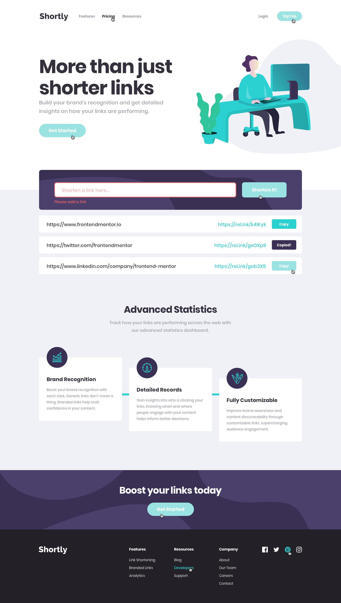

# Frontend Mentor - Shortly URL shortening API Challenge solution


This is a solution to the [Shortly URL shortening API Challenge challenge on Frontend Mentor](https://www.frontendmentor.io/challenges/url-shortening-api-landing-page-2ce3ob-G). Frontend Mentor challenges help you improve your coding skills by building realistic projects.

## Table of contents

- [Overview](#overview)
  - [The challenge](#the-challenge)
  - [Screenshot](#screenshot)
- [My process](#my-process)
  - [Built with](#built-with)
  - [What I learned](#what-i-learned)
  - [Continued development](#continued-development)
  - [Useful resources](#useful-resources)

## Overview

Simple homepage of a website with a working link shortener, hover states, and error states. Interactive mobile navigation menu. Links are saved until the session ends using Session Storage.

Working Login and Register User Form using Node.js and MYSQL Server (Not part of challenge).

API Used: shrtcode API

### The challenge

Users should be able to:

- View the optimal layout for the site depending on their device's screen size
- Shorten any valid URL
- See a list of their shortened links, even after refreshing the browser
- Copy the shortened link to their clipboard in a single click
- Receive an error message when the `form` is submitted if:
  - The `input` field is empty

### Screenshot

Desktop Design:
<br /> 

Mobile Design:
<br /> 
<br /> 

## My process

Started with breaking down the design into components. Then I added to basic HTML structure. After that, I transitioned into styling with css (first mobile then desktop). Once the css was all finished, I added the active states before adding some basic JS. Finally, I used the shrtcode API and session storage to finish my project. Later on, I came back and added a basic backend to my project. Stored user data within a MYSQL database.

### Built with

- HTML5
- TailwindCSS
- ReactJS
- NodeJS
- MYSQL
- Mobile First Workflow

### What I learned

I learned a lot about asynchronous functions and how they interact with APIs. Also learned how to implement APIs into my projects.

```jsx
const convertLink = async (link) => {
  const data = await fetch(`https://api.shrtco.de/v2/shorten?url=${link}`);
  const short = await data.json();

  // This will trigger the useEffect() hook.
  setShortLink(short.result.full_short_link);
};
```

I also learned a lot about how storage on a website works and when to use cookies, local storage, and system storage. Update: This has been replaced by a history system using user authentication.

```jsx
// Import history, if it exists.
const getStorage = () => {
  return JSON.parse(sessionStorage.getItem("history")) || [];
};

// Saves links in local memory for future use.
useEffect(() => {
  sessionStorage.setItem("history", JSON.stringify(history));
});
```

This project really helped me understand how ReactJS, NodeJS/ExpressJS, and Axios work together to create a full stack project.

```jsx
// Save link to user's account if it exists. Skip initial render.
useEffect(() => {
  if (isLoggedIn() && history.length != 0) {
    axios
      .post("http://localhost:3306/add", {
        links: JSON.stringify(history),
        email: login,
      })
      .catch((e) => {
        console.log(e);
      });
  }
}, [history]);

app.post("/add", (req, res) => {
  if (req.body.links) {
    const sql =
      "UPDATE `user-database`.`login` SET `links` = ? WHERE `email` = ?";
    db.query(sql, [req.body.links, req.body.email], (error, result) => {
      if (error) {
        console.log(error);
      }
    });
  }
});
```

### Continued development

I want to work more with APIs and get more practice using React. Right now everything is basically decorative, but in the future I would like to add other pages and create a working sign up and login interface.

Update: I have created a working sign up and login interface, but I would still like to have more practice with APIs and backend.

Update 2: I also introduced a history system into a user's account. Now for links to persist, a user would have to create an account and sign in. However, the way links are stored is not the most efficient (Using JSON formatting for a relational database) so for future projects I would like to use better practices.

### Useful resources

- [Storage](https://youtu.be/GihQAC1I39Q) - Great video to get you started with cookies, local storage, and session storage.
- [Async](https://youtu.be/li7FzDHYZpc) - Really helped me understand the difference between promises and asynchronous functions.
